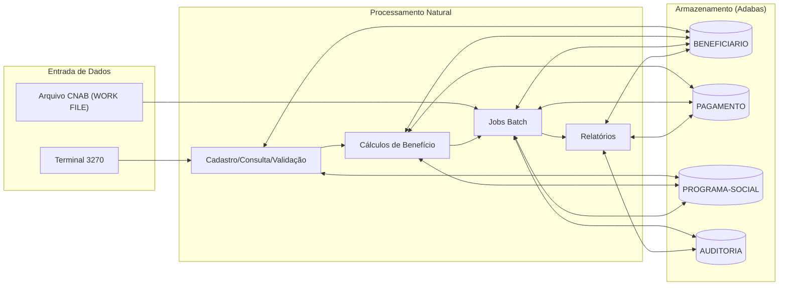

<!-- markdownlint-disable MD013 MD025 MD026 MD028 MD029 MD034 MD040 MD051 MD060 -->

# Mapa de Dependências — SIFAP Legado

  

> 🗺 **Você está aqui:** [Kit PT-BR](../README.md) → [Estágio 1](README.md) → **dependency-map**

> **Para quem é isto?** Este é um **artefato preenchido pelo time** durante o Estágio 1 (Arqueologia).
>
> **O que você terá ao final do estágio:**
>
> 1. Este documento totalmente preenchido com os dados reais do legado SIFAP
> 2. Rastreabilidade para `01-arqueologia/legado-sifap/` (programas `.NSN` e DDMs)
> 3. Base de evidência usada nas EARS do Estágio 2 (`source_legacy:`)
>
> 📘 **Guia passo a passo:** [`GUIDE.md`](GUIDE.md).

> Use diagramas Mermaid para mapear as dependências entre programas Natural e DDMs Adabas.
> O objetivo é visualizar "quem chama quem" e "quem lê/escreve o quê".

## Como descobrir dependências

- Use `grep` ou Copilot Chat para listar todas as ocorrências de `CALLNAT` nos 15 arquivos `.NSN`.
- Prompt útil: _"Liste todas as ocorrências de CALLNAT nestes arquivos e desenhe um diagrama Mermaid."_
- Para leitura/escrita em DDMs: procure por `READ`, `READ LOGICAL`, `STORE`, `UPDATE`, `DELETE`.

## Diagrama de Dependências entre Programas

> Mapa consolidado dos 15 programas `.NSN` e 4 DDMs reais do legado SIFAP.
> Evidência: varredura por `CALLNAT|CALL|FETCH|RUN` e operações `READ|FIND|STORE|UPDATE|DELETE` em `natural-programs/*.NSN`.

```mermaid
flowchart TD
 subgraph "Cadastros e Consulta (Online)"
 CADBENEF["CADBENEF.NSN"]
 CADDEPEND["CADDEPEND.NSN"]
 CADPROG["CADPROG.NSN"]
 CONSBENF["CONSBENF.NSN"]
 end

 subgraph "Validações"
 VALBENEF["VALBENEF.NSN"]
 VALDOCS["VALDOCS.NSN"]
 VALELEG["VALELEG.NSN"]
 end

 subgraph "Cálculo"
 CALCBENF["CALCBENF.NSN"]
 CALCCORR["CALCCORR.NSN"]
 CALCDSCT["CALCDSCT.NSN"]
 end

 subgraph "Batch e Relatórios"
 BATCHPGT["BATCHPGT.NSN"]
 BATCHCON["BATCHCON.NSN"]
 BATCHREL["BATCHREL.NSN"]
 RELPGT["RELPGT.NSN"]
 RELAUDIT["RELAUDIT.NSN"]
 end

 subgraph "DDMs Adabas"
 BENEF[("BENEFICIARIO")]
 PAG[("PAGAMENTO")]
 PROG[("PROGRAMA-SOCIAL")]
 AUD[("AUDITORIA")]
 end

 CADBENEF -->|FIND/STORE/UPDATE| BENEF
 CADDEPEND -->|FIND/UPDATE| BENEF
 CADPROG -->|FIND/STORE| PROG
 CONSBENF -->|FIND| BENEF
 CONSBENF -->|READ| PAG

 VALBENEF -->|VIEW ONLY| BENEF
 VALDOCS -->|VIEW ONLY| BENEF
 VALELEG -->|FIND| BENEF
 VALELEG -->|FIND| PROG

 CALCBENF -->|FIND| BENEF
 CALCBENF -->|FIND| PROG
 CALCBENF -->|STORE| PAG
 CALCCORR -->|READ/UPDATE| PAG
 CALCDSCT -->|FIND/UPDATE| PAG
 CALCDSCT -->|FIND| BENEF

 BATCHPGT -->|READ/FIND/STORE| PAG
 BATCHPGT -->|READ| BENEF
 BATCHPGT -->|FIND| PROG
 BATCHCON -->|FIND/UPDATE| PAG
 BATCHCON -->|READ/STORE| AUD
 BATCHREL -->|READ| PAG
 BATCHREL -->|FIND| BENEF
 RELPGT -->|READ| PAG
 RELPGT -->|FIND| BENEF
 RELAUDIT -->|READ| AUD
```

> **Resultado da varredura:** não foram encontradas chamadas `CALLNAT` entre os 15 programas.
> As dependências do legado estão concentradas em acesso compartilhado aos DDMs e rotinas internas via `PERFORM`.

## Diagrama de Fluxo de Dados (DDMs)

> DDMs reais identificados em `../01-arqueologia/legado-sifap/adabas-ddms/`: `BENEFICIARIO`, `PAGAMENTO`, `PROGRAMA-SOCIAL`, `AUDITORIA`.

## Tabela de Dependências

| Programa     | Chama (CALLNAT) | Lê (READ) DDMs | Escreve (STORE/UPDATE) DDMs | Observações |
| ------------ | --------------- | -------------- | --------------------------- | ----------- |
| BATCHCON.NSN | Nenhum identificado | AUDITORIA, PAGAMENTO | AUDITORIA (STORE), PAGAMENTO (UPDATE) | Conciliação de retorno CNAB e trilha de auditoria. |
| BATCHPGT.NSN | Nenhum identificado | BENEFICIARIO, PAGAMENTO, PROGRAMA-SOCIAL | PAGAMENTO (STORE) | Geração de pagamentos em lote. |
| BATCHREL.NSN | Nenhum identificado | BENEFICIARIO, PAGAMENTO | - | Consolidação para saída de relatório batch. |
| CADBENEF.NSN | Nenhum identificado | BENEFICIARIO | BENEFICIARIO (STORE/UPDATE) | Cadastro e manutenção de beneficiário. |
| CADDEPEND.NSN | Nenhum identificado | BENEFICIARIO | BENEFICIARIO (UPDATE) | Inclusão/atualização de dependentes no cadastro. |
| CADPROG.NSN | Nenhum identificado | PROGRAMA-SOCIAL | PROGRAMA-SOCIAL (STORE) | Cadastro de programas sociais. |
| CALCBENF.NSN | Nenhum identificado | BENEFICIARIO, PROGRAMA-SOCIAL | PAGAMENTO (STORE) | Calcula benefício e persiste pagamento. |
| CALCCORR.NSN | Nenhum identificado | PAGAMENTO | PAGAMENTO (UPDATE) | Aplica correção monetária em pagamentos. |
| CALCDSCT.NSN | Nenhum identificado | BENEFICIARIO, PAGAMENTO | PAGAMENTO (UPDATE) | Aplica descontos e atualiza pagamento. |
| CONSBENF.NSN | Nenhum identificado | BENEFICIARIO, PAGAMENTO | - | Consulta de beneficiário e histórico de pagamentos. |
| RELAUDIT.NSN | Nenhum identificado | AUDITORIA | - | Emissão de relatório de auditoria. |
| RELPGT.NSN | Nenhum identificado | BENEFICIARIO, PAGAMENTO | - | Relatório de pagamentos por período. |
| VALBENEF.NSN | Nenhum identificado | BENEFICIARIO (VIEW) | - | Regras de validação; sem READ/FIND explícito no código. |
| VALDOCS.NSN | Nenhum identificado | BENEFICIARIO (VIEW) | - | Validação documental; sem READ/FIND explícito no código. |
| VALELEG.NSN | Nenhum identificado | BENEFICIARIO, PROGRAMA-SOCIAL | - | Validação de elegibilidade por regras de programa. |

## Dependências Circulares

> Liste aqui qualquer dependência circular encontrada (programa A chama B que chama A):

- Nenhuma dependência circular por chamada entre programas (não há `CALLNAT` no conjunto analisado).

## Programas Órfãos

> Programas que não são chamados por nenhum outro (possíveis pontos de entrada ou código morto):

- Como não há `CALLNAT`, todos os 15 programas aparecem como órfãos no grafo de chamadas diretas:
- `BATCHCON.NSN`, `BATCHPGT.NSN`, `BATCHREL.NSN`, `CADBENEF.NSN`, `CADDEPEND.NSN`, `CADPROG.NSN`, `CALCBENF.NSN`, `CALCCORR.NSN`, `CALCDSCT.NSN`, `CONSBENF.NSN`, `RELAUDIT.NSN`, `RELPGT.NSN`, `VALBENEF.NSN`, `VALDOCS.NSN`, `VALELEG.NSN`.
- Interpretação: não indica necessariamente código morto; a orquestração pode ocorrer por menu JCL, scheduler batch, transação online ou chamada externa ao código-fonte analisado.

---

### Continuar a leitura

<table width="100%">
<tr>
<td width="50%" valign="top" align="left">
<strong>← ANTERIOR</strong> 
<a href="business-rules-catalog.md"><strong>business-rules-catalog.md</strong></a> 
Catálogo de regras.
</td>
<td width="50%" valign="top" align="right">
<strong>PRÓXIMO →</strong> 
<a href="discovery-report.md"><strong>discovery-report.md</strong></a> 
Síntese final.
</td>
</tr>
</table>

↑ <a href="README.md">Voltar ao Kit PT-BR</a>

