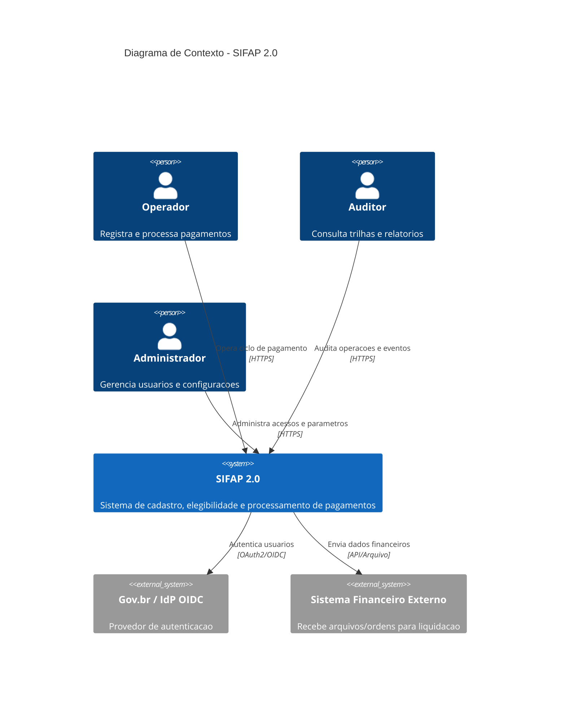
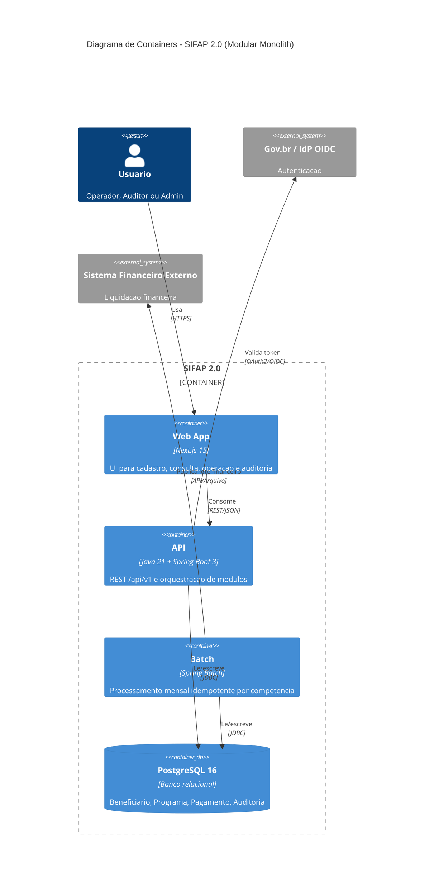

<!-- markdownlint-disable MD013 MD025 MD026 MD028 MD029 MD034 MD040 MD051 MD060 -->

# C4 Diagrams — SIFAP 2.0

## C4-L1 Contexto

## C4-L2 Containers

## Observacoes

- L1 e L2 focam no escopo de modernizacao do workshop.
- Nivel de componentes (L3) fica opcional e pode ser detalhado no Estagio 3 se necessario.
